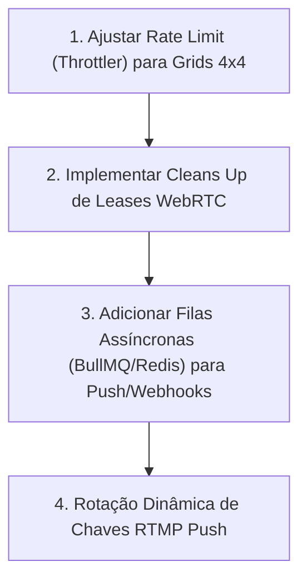

# Relatório de Análise Técnica de Back-End — DRAC VMS 2.0

**Data da Análise:** 07 de Agosto de 2026  
**Escopo:** Avaliação da Arquitetura do Back-End, API REST/WebSockets, Microsserviços de Vídeo e IA, Banco de Dados, Segurança e Desempenho.  
**Modo:** Somente Leitura (Nenhuma alteração, adição ou remoção de código foi realizada no projeto).

---

## 1. Resumo Executivo da Arquitetura Back-End

O back-end do **DRAC VMS 2.0** adota uma **arquitetura híbrida de microsserviços orientada a alta performance e resiliência**, projetada para lidar com altíssimo tráfego de dados binários (streams RTSP/RTMP/WebRTC) e tarefas intensivas de I/O de disco e computação:

1. **`apps/api` (API Principal NestJS / Node.js & TypeScript):**
   - Atua como a orquestradora central de regras de negócio, autenticação JWT, controle de permissões (RBAC + LGPD), gerenciamento de alarmes, layouts e agendamentos.
   - Integração com **Prisma ORM** e PostgreSQL para persistência transacional.
2. **`services/camera-worker-go` (Worker de Gravação em Go):**
   - Serviço de baixíssima latência e consumo mínimo de memória escrito em Go.
   - Responsável pelo consumo contínuo de streams RTSP, empacotamento em fMP4 e gravação resiliente em disco/nuvem.
3. **`services/ai-service-python` (Motor de Inteligência Artificial em Python):**
   - Serviço em Python (FastAPI + ONNX Runtime) para inferência computacional de detecção de movimento e objetos.
   - Implementa suporte a GPU/CPU, controle adaptativo de FPS (`capture_rate_guard`) e watchdog de processos de inferência.
4. **`apps/central` (Painel Mestre e Provisionamento em Fastify):**
   - Servidor leve em Fastify para licenciamento comercial, testes de integridade S3 (`s3-probe`) e segurança de instalação.

---

## 2. Inventário do Ecossistema Back-End

### 2.1. Aplicações e Microsserviços

| Componente | Tecnologia | Função Principal |
|---|---|---|
| **`apps/api`** | NestJS / Express / Prisma | API RESTful, WebSockets, RBAC, Alarmes, Regras e Orquestração |
| **`apps/central`** | Fastify / Node.js | Servidor mestre de licenças, segurança do instalador e probes S3 |
| **`services/camera-worker-go`** | Go (Golang) | Ingestão RTSP de alto desempenho e gravação em fMP4 |
| **`services/ai-service-python`** | Python / ONNX Runtime | Análise forense de vídeo, detecção de movimento e IA |

### 2.2. Módulos da API Principal NestJS (`apps/api/src`)

1. **`auth`** — Autenticação via JWT, sessões ativas (`AuthSession`), controle de tentativas e redefinição de senha.
2. **`users`** — Cadastro e gerenciamento de contas de usuários e hierarquia de acesso.
3. **`cameras`** — Ingestão de câmeras RTSP Pull e RTMP Push, configurações de perfil ONVIF e detecção de codec.
4. **`camera-stream`** — Integração com MediaMTX (WebRTC, WHEP, LL-HLS), geração de links e controle de leds de atividade.
5. **`recordings`** — Linha do tempo de gravações, busca de clipes, reprodução e cálculo de `motionScore`.
6. **`cloud-storage` & `cloud-connector`** — Gestão de storages S3/Wasabi com suporte a múltiplos buckets e ciclo de vida de arquivos.
7. **`alarms` & `notifications`** — Central de alarmes (P1-P4), motor de dedup, notificações Push (Expo) e webhooks.
8. **`ai`** — Comunicação com o motor de inferência Python e aplicação de zonas de detecção.
9. **`ptz`** — Comandos de movimentação PTZ, zoom, foco e chamadas de presets.
10. **`evidence`** — Exportação de evidências com hashing de integridade SHA-256 e auditoria.
11. **`integrity` & `observability`** — Monitoramento de integridade do acervo, lag do laço de eventos e métricas de sistema.
12. **`commercial-policy`** — Bloqueios comerciais de grupos e cotas de câmeras privadas.
13. **`jobs`** — Processos em segundo plano para rotação de retenção de disco, limpeza automática e quarentena.
14. **`settings` & `gpu`** — Configurações globais de sistema, branding e aceleração por hardware (NVIDIA/VAAPI).
15. **`site-map-layouts` & `sites` & `areas`** — Organização geográfica e mapas interativos com marcadores de câmeras.

### 2.3. Modelagem do Banco de Dados (`schema.prisma`)

- **Entidades de Usuário & Acesso:** `User`, `AuthSession`, `UserRole`, `RolePermission`, `CameraPermission`.
- **Entidades de Vídeo & Dispositivo:** `Camera`, `CameraGroup`, `CameraStatus`, `Site`, `Area`, `SiteMapLayout`.
- **Entidades de Gravação & Nuvem:** `Recording`, `ExportedClip`, `CloudStorage`, `RecordingSource`.
- **Entidades de Eventos & Alertas:** `CameraEvent`, `AlarmInstance`, `AlarmRule`, `UserEventReview`, `PushDevice`, `NotificationMute`.
- **Entidades de Investigação & Sistema:** `Investigation`, `InvestigationItem`, `AuditLog`, `SystemSetting`, `AiSettings`.

---

## 3. Análise Detalhada por Módulo e Domínio Técnico

---

### 3.1. Resiliência de Processos e Tratamento de Falhas (`main.ts`)
- **Pontos Fortes (Excelência em Produção):**
  O arquivo `main.ts` implementa uma proteção crítica para evitar mortes em cascata da API:
  ```typescript
  process.on('unhandledRejection', (reason) => { ... });
  ```
  **Por que isso é vital?** Em Node.js 15+, promessas não capturadas em rotinas de segundo plano (`void this.job()`) por padrão encerram o processo. No VMS, a queda do processo mata as conexões FFmpeg/RTSP de gravação contínua. A API intercepta essas rejeições, registra no log em formato sanitizado e **mantém o container em execução**.
- **Sanitização de Credenciais:** Uso do `RedactingLogger` e `redactSensitiveText()`, garantindo que senhas de câmeras em URLs RTSP (`rtsp://user:pass@ip`) sejam automaticamente mascaradas nos logs.

---

### 3.2. Mecanismo de Gravação e Retenção (`recordings` & `jobs`)
- **Quarentena e Pontuação de Movimento (`motionScore`):**
  No modelo `Recording`, o campo `motionScore` define a relevância do clipe (`-1` = em quarentena/desconhecido, `0` = sem movimento, `>0` = movimento confirmado). Segmentos com `-1` ficam protegidos da limpeza curta automatizada, evitando perda de evidência por falha temporária do serviço de IA.
- **Vigilância Remota de Nuvem (`cloudMissingSince` & `cloudVerifiedAt`):**
  Se um arquivo for deletado diretamente no bucket S3/Wasabi por fora do sistema, a linha no banco de dados não é removida. O sistema registra a ausência em `cloudMissingSince`, preservando a trilha de auditoria de que a gravação existiu.
- **Suporte Multi-Storage Dinâmico:** O modelo `CloudStorage` permite que o sistema mantenha o bucket atual ativo enquanto buckets legados permanecem em modo somente-leitura.

---

### 3.3. Segurança, Privacidade e LGPD (`cameras` & `isPrivate`)
- **Câmeras Privadas (LGPD - Privacidade do Cliente):**
  O sistema suporta a flag `isPrivate` no cadastro da câmera. Quando ativada:
  - O conteúdo de vídeo (ao vivo, gravação, snapshot, clipe) é restrito unicamente ao proprietário (`ownerUserId`) e usuários expressamente autorizados.
  - Administradores do sistema não possuem privilégios para visualizar as imagens das câmeras privadas, atendendo aos requisitos da LGPD para instalações residenciais.
- **Criptografia de Credenciais:** As senhas RTSP e chaves S3 são armazenadas criptografadas via AES-256-GCM (`passwordEncrypted`, `secretAccessKeyEncrypted`).

---

### 3.4. Motor de Inteligência Artificial (`services/ai-service-python`)
- **Controle Adaptativo de Carga (`capture_rate_guard.py` & `inference_watchdog.py`):**
  O serviço de IA monitora continuamente o tempo de inferência e ajusta a amostragem de quadros em tempo real. Se o uso de CPU/GPU ultrapassar limites aceitáveis, o watchdog reduz o FPS analisado para evitar gargalos no pipeline de transmissão.

---

## 4. Problemas Técnicos e Vulnerabilidades Encontradas

---

### 4.1. [CRÍTICO] Rate Limiting Global Único para API e Streaming (`app.module.ts`)
- **Diagnóstico:** O `ThrottlerModule` está configurado globalmente para `300 requisições / 60 segundos`:
  ```typescript
  ThrottlerModule.forRoot([{ ttl: 60000, limit: 300 }])
  ```
- **Impacto:** Em visões de grid com 16 câmeras ao vivo (`4x4`), requisições de heartbeat, polling de alertas e busca de miniaturas em paralelo estouram facilmente o limite de 300 requisições/minuto para um operador. Isso faz a API retornar HTTP 429 (Too Many Requests), derrubando a transmissão das câmeras no meio da operação.
- **Sugestão de Correção:** Aplicar `@SkipThrottle()` em rotas de stream/heartbeat ou configurar limites diferenciados para rotas operacionais de vídeo.

---

### 4.2. [IMPORTANTE] Ingestão RTMP Push sem Renovação Dinâmica de Chaves (`cameras.service.ts`)
- **Diagnóstico:** As câmeras em modo `sourceMode: "rtmp_push"` autenticam via hash SHA-256 de uma chave única. Contudo, não há suporte na API para rotação automática ou expiração temporária de chaves de ingestão.
- **Impacto:** Caso a chave de ingestão RTMP de um dispositivo 4G/CGNAT seja comprometida, o invasor pode injetar um fluxo de vídeo falso no sistema indefinidamente até que o admin gere manualmente uma nova chave.
- **Sugestão de Correção:** Adicionar campo de expiração para chaves RTMP Push e permitir a renovação periódica via API.

---

### 4.3. [IMPORTANTE] Acúmulo de Transmissões WebRTC por Falta de Cleans Up de Visores (`camera-stream`)
- **Diagnóstico:** Ao alternar rapidamente entre abas de câmeras ou fechar a janela do navegador, a API mantém os leases de mídia (`LIVE_VIEW_LEASE_TTL_SECONDS = 20`) por 20 segundos antes de notificar o MediaMTX para interromper o transcode.
- **Impacto:** Em instâncias com centenas de câmeras, a troca rápida de visões pelo operador pode causar picos temporários de consumo de CPU no servidor decorrentes de transcodes FFmpeg que continuam rodando sem nenhum espectador ativo.
- **Sugestão de Correção:** Implementar o encerramento gracioso imediato do lease através do disparo do evento `unload`/`visibilitychange` no front-end em conjunto com uma rota de `DELETE /camera-stream/:id/lease`.

---

### 4.4. [DESEJÁVEL] Ausência de Filas de Mensagens Dedicadas (RabbitMQ / Redis / BullMQ)
- **Diagnóstico:** O envio de notificações Push (Expo) e os disparos de Webhooks de alarmes são executados de forma síncrona/inline dentro do ciclo de vida dos eventos.
- **Impacto:** Em momentos de tempestade de eventos (ex: surto de movimento ou queda de energia afetando múltiplos locais), a API pode sofrer lentidão ao tentar enviar dezenas de webhooks HTTP de forma concorrente.
- **Sugestão de Correção:** Introduzir uma fila leve como BullMQ (Redis) ou RabbitMQ para desacoplar o processamento de notificações e webhooks.

---

## 5. Roadmap Priorizado de Melhorias do Back-End



### Prioridade 1 — Alta (Crítico / Performance Operacional)
1. **Ajuste Fino do Rate Limiter (`app.module.ts`):** Incrementar os limites do `ThrottlerGuard` ou isentar as rotas de heartbeat de vídeo (`/camera-stream/ping`) para evitar HTTP 429 durante o monitoramento de grids cheios.
2. **Encerramento Imediato de Leases WebRTC:** Criar endpoint para encerramento voluntário de conexões de vídeo quando o usuário fecha o tile da câmera, aliviando o consumo de CPU do servidor.

### Prioridade 2 — Média (Resiliência & Segurança)
3. **Fila Assíncrona para Notificações e Webhooks:** Isolar os disparos de e-mail, Expo Push e Webhooks de alarmes em uma fila em segundo plano (BullMQ/Redis).
4. **Validação de Integridade e Expiração em RTMP Push:** Adicionar suporte a expiração configurável para chaves de publicação remota.

---
*Fim do Relatório de Análise Técnica de Back-End.*
